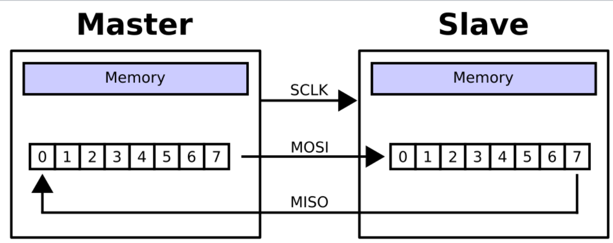

# SPI
Verilog implementation of the SPI Protocol

## INTRODUCTION :

Serial Peripheral Interface (SPI) is a synchronous four-wire serial communication protocol used by microcontrollers to talk to nearby peripheral devices quickly.
The SPI (Serial Peripheral Interface) protocol is a synchronous, full-duplex, master-slave-based serial communication interface used for short-distance communication, typically between microcontrollers and peripheral devices (like sensors, SD cards, or shift registers).

SPI is a common communication protocol used by many different devices. For example, SD card reader modules, RFID card reader modules, and 2.4 GHz wireless transmitter/receivers all use SPI to communicate with microcontrollers.

One unique benefit of SPI is the fact that data can be transferred without interruption. Any number of bits can be sent or received in a continuous stream. With I2C and UART, data is sent in packets, limited to a specific number of bits. Start and stop conditions define the beginning and end of each packet, so the data is interrupted during transmission.

Devices communicating via SPI are in a master-slave relationship. The master is the controlling device (usually a microcontroller), while the slave (usually a sensor, display, or memory chip) takes instruction from the master. The simplest configuration of SPI is a single master, single slave system, but one master can control more than one slave 

- Typically SPI includes :

**MOSI (Master Output/Slave Input):** Line for the master to send data to the slave.

**MISO (Master Input/Slave Output):** Line for the slave to send data to the master.

**SCLK (Clock):** Line for the clock signal.

**SS/CS (Slave Select/Chip Select):** Line for the master to select which slave to send data to.

## HOW SPI WORKS :

- ## THE CLOCK:

The clock signal synchronizes the output of data bits from the master to the sampling of bits by the slave. One bit of data is transferred in each clock cycle, 
so the speed of data transfer is determined by the frequency of the clock signal. SPI communication is always initiated by the master since the master configures and generates the clock signal.

Any communication protocol where devices share a clock signal is known as synchronous. SPI is a synchronous communication protocol. 
There are also asynchronous methods that don’t use a clock signal. For example, in UART communication, both sides are set to a pre-configured baud rate that dictates the speed and timing of data transmission.

The clock signal in SPI can be modified using the properties of clock polarity and clock phase. These two properties work together to define when the bits are output and when they are sampled. Clock polarity can be set by the master to allow for bits to be output and sampled on either the rising or falling edge of the clock cycle. Clock phase can be set for output and sampling to occur on either the first edge or second edge of the clock cycle, regardless of whether it is rising or falling.

- ## SLAVE SELECT:

The master can choose which slave it wants to talk to by setting the slave’s CS/SS line to a low voltage level. In the idle, non-transmitting state, the slave select line is kept at a high voltage level.
Multiple CS/SS pins may be available on the master, which allows for multiple slaves to be wired in parallel. If only one CS/SS pin is present, multiple slaves can be wired to the master by daisy-chaining.

- ## MULTIPLE SELECT :

SPI can be set up to operate with a single master and a single slave, and it can be set up with multiple slaves controlled by a single master. 
There are two ways to connect multiple slaves to the master. If the master has multiple slave select pins, the slaves can be wired in parallel like this:

## DATA TRANSMISSION :

To begin communication, the SPI master first selects the device it wants to communicate with by pulling its SS low. 
If a waiting period is required, such as for an analog-to-digital conversion, the master must wait for at least that period of time before issuing clock cycles.

During each SPI clock cycle, full-duplex transmission of a single bit occurs. The master sends a bit on the MOSI line while the slave sends a bit on the MISO line, and then each reads their corresponding incoming bit. This sequence is maintained even when only one-directional data transfer is intended.

Transmission using a single slave involves one shift register in the master and one shift register in the slave, both of some given word size (e.g. 8 bits). The transmissions often consist of eight-bit words, but other word-sizes are also common.

Data is usually shifted out with the most-significant bit (MSB) first but the original specification has a LSBFE ("LSB-First Enable") to control whether data is transferred least (LSB) or most significant bit (MSB) first. On the clock edge, both master and slave shift out a bit to its counterpart.

On the next clock edge, each receiver samples the transmitted bit and stores it in the shift register as the new least-significant bit. After all bits have been shifted out and in, the master and slave have exchanged register values. If more data needs to be exchanged, the shift registers are reloaded and the process repeats. 
Transmission may continue for any number of clock cycles. When complete, the master stops toggling the clock signal, and typically deselects the slave.

- **CLOCK POLARTITY PHASE:**

  The master must also configure the clock polarity and phase with respect to the data , it named these two options as CPOL and CPHA (for clock polarity and clock phase) respectively.
  CPOL represents the polarity of the clock. Polarities can be converted with a simple inverter.
  
  SCLK CPOL=0 is a clock which idles at the logical low voltage.
  
  SCLK CPOL=1 is a clock which idles at the logical high voltage.
    
  CPHA represents the phase of each data bit's transmission cycle relative to SCLK.

- **For CPHA=0:**
  
The first data bit is output immediately when SS activates.
Subsequent bits are output when SCLK transitions to its idle voltage level.
Sampling occurs when SCLK transitions from its idle voltage level.

- **For CPHA=1:**
  
The first data bit is output on SCLK's first clock edge after SS activates.
Subsequent bits are output when SCLK transitions from its idle voltage level.
Sampling occurs when SCLK transitions to its idle voltage level.
Conversion between these two phases is non-trivial.

## SPI MASTER :
This Verilog code implements an 8-bit SPI Master controller. The SPI master sends an 8-bit data word to an SPI slave through the MOSI line and simultaneously receives an 8-bit data word from the slave through the MISO line. The design uses a finite-state machine, clock divider, transmit/receive shift registers, and transfer-status signals.

The main inputs are clk, rst, start, mosi_data, and miso. The clk input is the system clock, while rst resets the controller. The start signal begins an SPI transfer. The 8-bit mosi_data input contains the data to be transmitted, and miso receives serial data from the SPI slave.

The main outputs are cs, sclk, mosi, miso_data, busy, and done. cs is the active-low chip-select signal. sclk is the SPI serial clock generated by the master. mosi transmits serial data to the slave, and miso_data stores the received 8-bit data. The busy signal is high while communication is taking place, while done becomes high after the complete transfer is finished.
The controller uses four states:

- **IDLE:**  The SPI master waits for the start signal. In this state, cs remains high, meaning no slave is selected.
  
- **CS_LOW:** After start is received, the master drives cs low and loads mosi_data into the transmit register (tx).
  
- **TRANSFER:** The master generates sclk, sends bits serially on MOSI, and receives bits serially on MISO. Eight bits are transferred.
  
- **CS_HIGH:** After eight bits are completed, the master deasserts cs, copies the received register value to miso_data, sets done = 1, and clears busy.
  
The clock divider uses the parameter CLK_DIV = 2. It divides the system clock to generate the SPI clock. The sclk signal toggles whenever clk_count reaches CLK_DIV - 1. This makes the SPI clock slower than the input system clock and provides suitable timing for serial communication.

During transmission, the transmit register tx stores the input byte. The bit_count keeps track of how many bits have been transferred. The code sends data in MSB-first order using:
## mosi = tx[7-bit_count];

Therefore, if mosi_data = 8'b10101100, the transmitted sequence on MOSI is:
1 → 0 → 1 → 0 → 1 → 1 → 0 → 0

At the same time, the receive logic samples the miso input and stores each incoming bit in the receive register rx. After eight clock cycles, the received byte is moved to the miso_data output.
The testbench generates a system clock with a period of 10 ns using:
## always #5 clk = ~clk;

It initially applies reset, sets mosi_data to 8'b10101100, releases reset, and gives a pulse on start to begin the SPI transfer. The testbench then drives a known bit pattern on miso at each positive edge of sclk:
0 → 1 → 0 → 1 → 1 → 0 → 0 → 1

This corresponds to the received value:
## miso_data = 8'b01011001;

OUTPUT:

