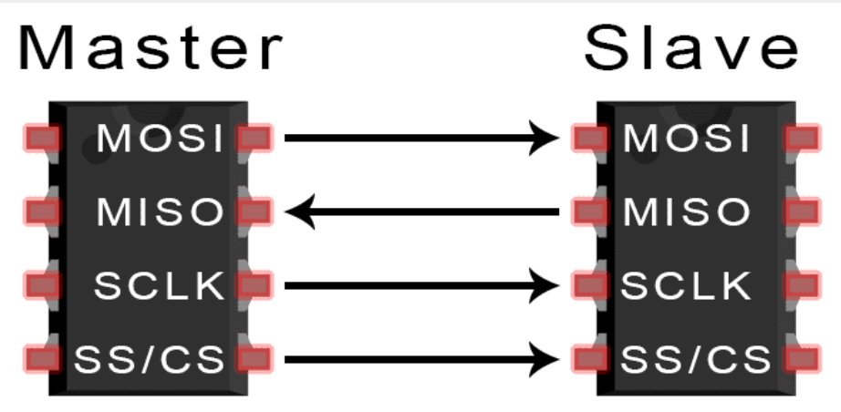
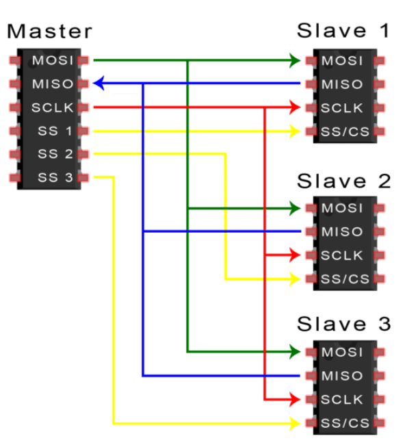

# SPI
Verilog implementation of the SPI Protocol

## INTRODUCTION :

Serial Peripheral Interface (SPI) is a synchronous four-wire serial communication protocol used by microcontrollers to talk to nearby peripheral devices quickly.
The SPI (Serial Peripheral Interface) protocol is a synchronous, full-duplex, master-slave-based serial communication interface used for short-distance communication, typically between microcontrollers and peripheral devices (like sensors, SD cards, or shift registers).

SPI is a common communication protocol used by many different devices. For example, SD card reader modules, RFID card reader modules, and 2.4 GHz wireless transmitter/receivers all use SPI to communicate with microcontrollers.

One unique benefit of SPI is the fact that data can be transferred without interruption. Any number of bits can be sent or received in a continuous stream. With I2C and UART, data is sent in packets, limited to a specific number of bits. Start and stop conditions define the beginning and end of each packet, so the data is interrupted during transmission.

Devices communicating via SPI are in a master-slave relationship. The master is the controlling device (usually a microcontroller), while the slave (usually a sensor, display, or memory chip) takes instruction from the master. The simplest configuration of SPI is a single master, single slave system, but one master can control more than one slave 

- Typically SPI includes :

**MOSI (Master Output/Slave Input):** Line for the master to send data to the slave.

**MISO (Master Input/Slave Output):** Line for the slave to send data to the master.

**SCLK (Clock):** Line for the clock signal.

**SS/CS (Slave Select/Chip Select):** Line for the master to select which slave to send data to.

## HOW SPI WORKS :

- ## THE CLOCK:

The clock signal synchronizes the output of data bits from the master to the sampling of bits by the slave. One bit of data is transferred in each clock cycle, 
so the speed of data transfer is determined by the frequency of the clock signal. SPI communication is always initiated by the master since the master configures and generates the clock signal.

Any communication protocol where devices share a clock signal is known as synchronous. SPI is a synchronous communication protocol. 
There are also asynchronous methods that don’t use a clock signal. For example, in UART communication, both sides are set to a pre-configured baud rate that dictates the speed and timing of data transmission.

The clock signal in SPI can be modified using the properties of clock polarity and clock phase. These two properties work together to define when the bits are output and when they are sampled. Clock polarity can be set by the master to allow for bits to be output and sampled on either the rising or falling edge of the clock cycle. Clock phase can be set for output and sampling to occur on either the first edge or second edge of the clock cycle, regardless of whether it is rising or falling.

- ## SLAVE SELECT:

The master can choose which slave it wants to talk to by setting the slave’s CS/SS line to a low voltage level. In the idle, non-transmitting state, the slave select line is kept at a high voltage level.
Multiple CS/SS pins may be available on the master, which allows for multiple slaves to be wired in parallel. If only one CS/SS pin is present, multiple slaves can be wired to the master by daisy-chaining.

- ## MULTIPLE SELECT :

SPI can be set up to operate with a single master and a single slave, and it can be set up with multiple slaves controlled by a single master. 
There are two ways to connect multiple slaves to the master. If the master has multiple slave select pins, the slaves can be wired in parallel like this:

## DATA TRANSMISSION :

